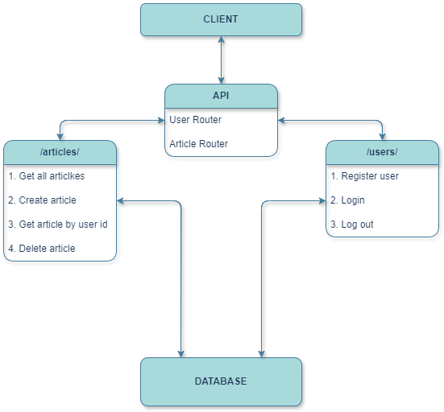

## API endpoints description:

The entire interaction between the client and the API occurs via JSON. 
Additionally, the API utilizes basic authorization. 
Therefore, almost all endpoints are private and work exclusively for registered and authorized users.

- API
  - Users Router - `/users/`
    - `GET /users/`           - `[admin only]`            - Get all users 
    - `POST /users/register/` - `[public]`                - Register new users 
    - `POST /users/login/`    - `[public]`                - Login users 
    - `POST /users/logout/`   - `[autorization required]` - Logout users 
    
  - Articles Router - `/articles/`
    - `GET /articles/`                - `[public]`                - Get all articles 
    - `GET /articles/by-user/`        - `[autorization required]` - Get articles by user 
    - `POST /articles/`               - `[autorization required]` - Create new articles 
    - `DELETE /articles/{article_id}` - `[autorization required]` - Delete articles 

## Diagram 


## Tech stack:

- **Framework**: FastAPI
- **Database ORM**: SQLModel 
  - ( **Based on** - SQLAlchemy (2.0.28) )
- **ASGI Server**: uvicorn (0.29.0)
- **Data Validation**: Pydantic (2.6.4)
- **Dependency Injection**: FastAPIs dependency injection mechanism
- **Testing Framework**: pytest (8.1.1)

This stack provides a comprehensive set of tools for building asynchronous web applications with FastAPI, 
including database interaction, data validation, 
testing, and additional utilities for configuration and template rendering.

## Usage

1. Build and start the Docker containers:

    ```bash
    docker-compose up --build
    ```

2. Once the containers are up and running, you can access your FastAPI application at `http://0.0.0.0:9876`.

3. Open your web browser and navigate to `http://0.0.0.0:9876/docs` to access the Swagger UI for interacting with the API.

4. Explore the available endpoints and interact with them as needed.

5. To stop the containers, you can use `Ctrl + C` in the terminal where `docker-compose` is running, and then run:

    ```bash
    docker-compose down
    ```


DONE:
====
- ~~App structure~~
- ~~Database~~ `(SQLite)`
- ~~Models & Schemas~~
- ~~Routers & handlers~~
- ~~`CRUD` service~~
- ~~Add `Basic HTTP Auth`~~
- ~~Add `CORS`~~
- ~~Add `tests`~~
- ~~Add `config.py` 2/2~~
- ~~End `dockerfile`~~
- ~~Extend `Readme`~~


Possible future improvements:
==== 
- Migrate DB to `PostgreSQL`
- Migrations with `Alembic`
